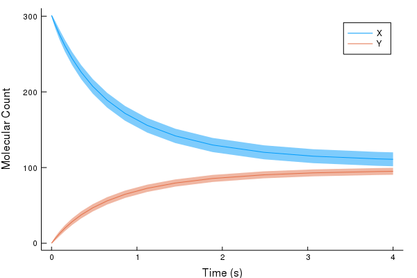

# MomentExpansions.jl

(Note: -> Early Development)

MomentExpansions.jl is an add-on package to DiffEqBiological.jl.

The package facilitates the generation and simulation of ODE moment expansions of chemical reaction networks. For further information, see the following paper: [Ale et al, 2013](https://aip.scitation.org/doi/10.1063/1.4802475)

## Example: Dimerisation Model

A simple dimerisation model, comprising two species and two reactions can be defined using the Reaction DSL (domain specific language) syntax described within DiffEqBiological.jl as below:

```julia
using MomentExpansions
rn = @reaction_network dimer begin
    (k1, k2), X + X ↔ Y
    end k1 k2
```

To create a moment expansion of order 2, we can call the `approx` function, inputting the reaction network and desired truncation order:

```julia
expansion = approx(rn, 2)
```

This creates a `MomentExpansion` container, storing information about the moments, and their ODE equations.

We can create an `ODEProblem` object just as within any normal DifferentialEquations.jl environment, specifying the time interval, initial species, and parameter values.

```julia
# (u0 = [301, 0], the further 3 central moments are assumed to be equal to 0)
u0 = [301, 0.0, 0.0, 0.0, 0.0]
tspan = (0.0, 4.0)
p = [3.32e-3, 0.2]
prob = ODEProblem(expansion, u0, tspan, p)
```

Using the DifferentialEquations library, we can then solve the system.

```julia
using DifferentialEquations
sol = solve(prob, Tsit5())
```

This produces a solution for the means, `E[X]` and `E[Y]`, and their corresponding second order moments `E[(X-E[X])^2], E[(X-E[X])(Y-E[Y])], E[(Y-E[Y])^2]`.

Using the information about the means, and their second order moments, we can make plots --- e.g. ribbon plots showing the means of `X` and `Y`, alongside their respective standard deviations.

```julia
using Plots
p1 = plot(sol.t, sol[1,:], ribbon=sqrt.(sol[3,:]), label="X", xlabel="Time (s)", ylabel="Molecular Count", grid=false)
plot!(sol.t, sol[2,:], ribbon=sqrt.(sol[5,:]), label="Y")
```


